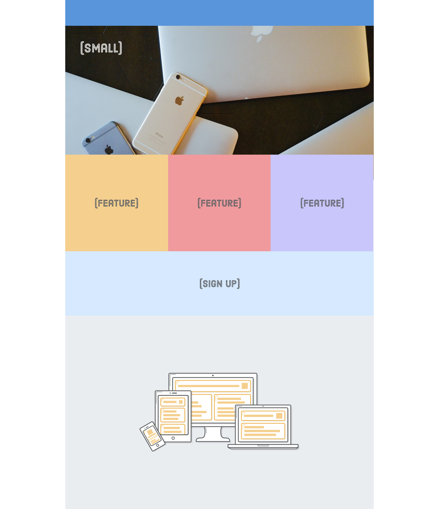

# Interneting Is Hard - Responsive Design

This is a solution to the [Responsive Design tutorial No. 10 of HTML & CSS Is Hard](https://www.internetingishard.com/html-and-css/responsive-design/).

## Table of contents

- [Overview](#overview)
  - [Screenshot](#screenshot)
  - [Links](#links)
- [My process](#my-process)
  - [Built with](#built-with)
  - [What I learned](#what-i-learned)
  - [Continued development](#continued-development)
  - [Useful resources](#useful-resources)
- [Author](#author)
- [Acknowledgments](#acknowledgments)

## Overview

### Screenshot



### Links

- Solution URL: [Responsive Design solution](https://github.com/jugglingdev/responsive-design)
- Live Site URL: [Responsive Design live site](https://jugglingdev.github.io/responsive-design/)

## My process

### Built with

- Semantic HTML5 markup
- CSS custom properties

### What I learned

I enjoyed working with responsive design in this tutorial.  I deeply appreciate making sites user friendly on your phone just as much as your desktop, so it was neat to peek behind the curtain.

The biggest tool in today's toolbox was media queries.  These set conditions based on screen size.  Samples of the media queries code are below.

This tutorial took a mobile-first approach in design.  This keeps the base styles outside the media queries for easy updating.

While the mobile and tablet media queries had fluid widths, the desktop width was fixed and centered with auto-margins.  The neat thing with flexbox is that the order was easily changed around for desktop widths using the `order` property.

One thing to remember to add to the `<head>` of the document is the code to disable viewport zooming so mobile devices can actually use the mobile layout.  The code for this is below.

*RETINA SCREENS*

Code snippets from this tutorial include:

```css
/* Mobile Styles */
@media only screen and (max-width: 400px) {
  body {
    background-color: #F09A9D;
  }
}

/* Tablet Styles */
@media only screen and (min-width: 401px) and (max-width: 960px) {
  body {
    background-color: #F5CF8E;
  }
}

/* Desktop Styles */
@media only screen and (min-width: 961px) {
  body {
    background-color: #B2D6FF;
  }
}
```

```html
<!-- Code to disable viewport zooming -->
<meta name="viewport"
      content="width=device-width, initial-scale=1.0, maximum-scale=1.0">
```

### Continued development

Use this section to outline areas that you want to continue focusing on in future projects. These could be concepts you're still not completely comfortable with or techniques you found useful that you want to refine and perfect.

### Useful resources

- [MDN @media](https://developer.mozilla.org/en-US/docs/Web/CSS/@media) - More details on media queries.

- [Learn Responsive Design](https://web.dev/learn/design/intro/) - Great explanation of responsive design.

## Author

- GitHub - [@jugglingdev](https://github.com/jugglingdev)

- freeCodeCamp - [@jugglingdev](https://www.freecodecamp.org/jugglingdev)

- Frontend Mentor - [@jugglingdev](https://www.frontendmentor.io/profile/jugglingdev)

- LinkedIn - [Kayla Paden](https://www.linkedin.com/in/kayla-marie-paden)

## Acknowledgments

Shoutout to Oliver James for his dedication to publishing and maintaining InternetingIsHard.com.  His tutorials were the first that really clicked for me.